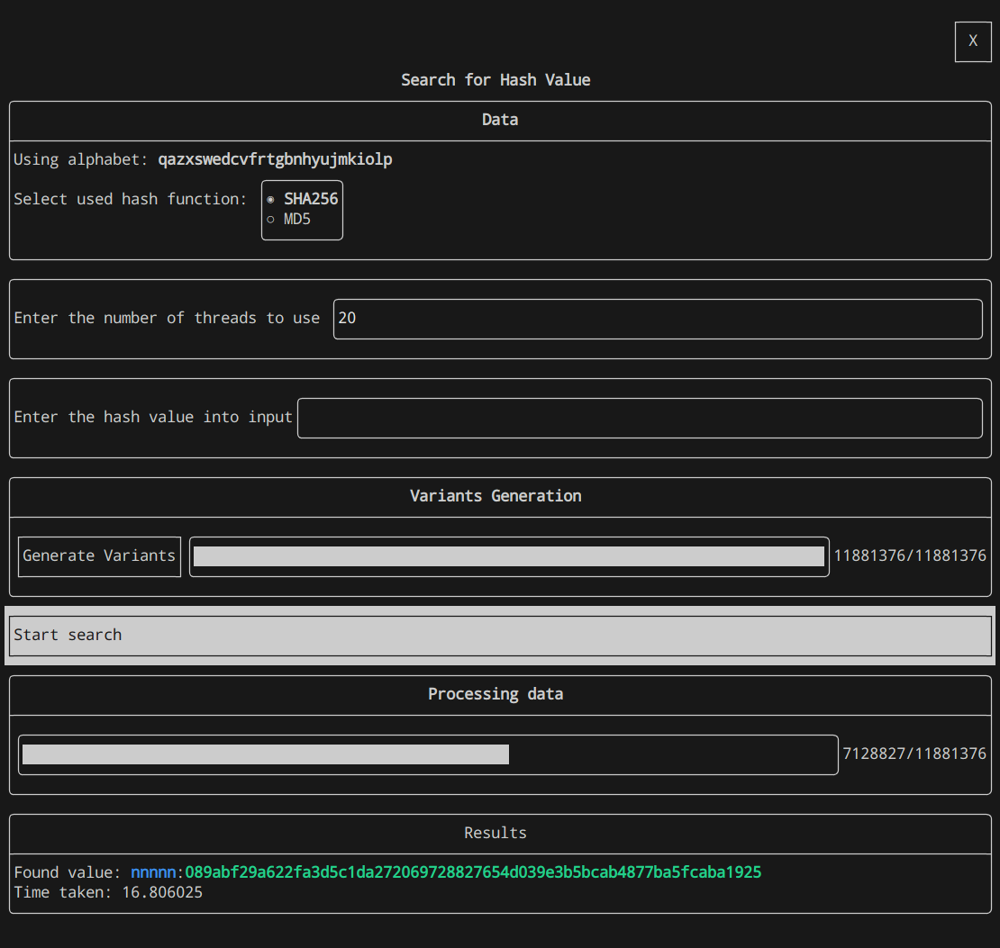

# custom-thread-worker

Простая TUI утилита для нахождения значения, на основе которого был вычислен хэш. Для нахождения значения используется полный пебеор (в многопоточном режиме)

## Установка
1. `git clone https://github.com/kotobazza/custom_thread_worker.git`
2. `mkdir build && cd build`
3. `cmake ..`
4. `make` 

## Используемые библиотеки
+ OpenSSL
+ [FTXUI](https://github.com/ArthurSonzogni/FTXUI)

